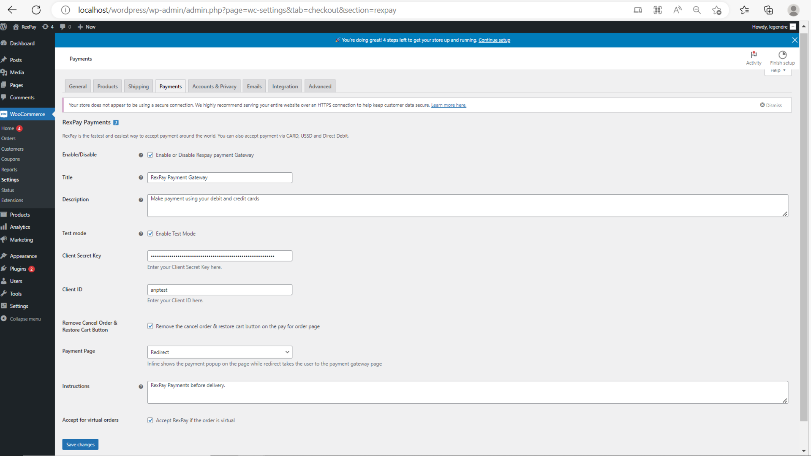
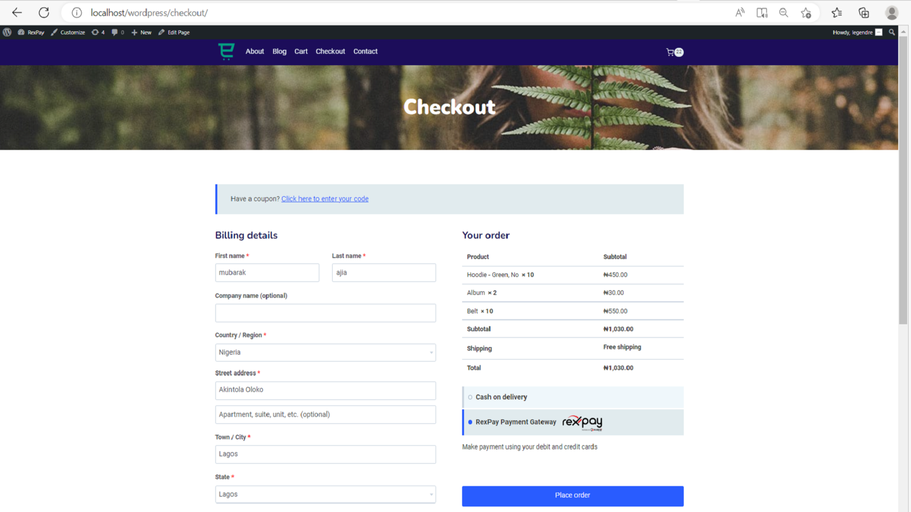
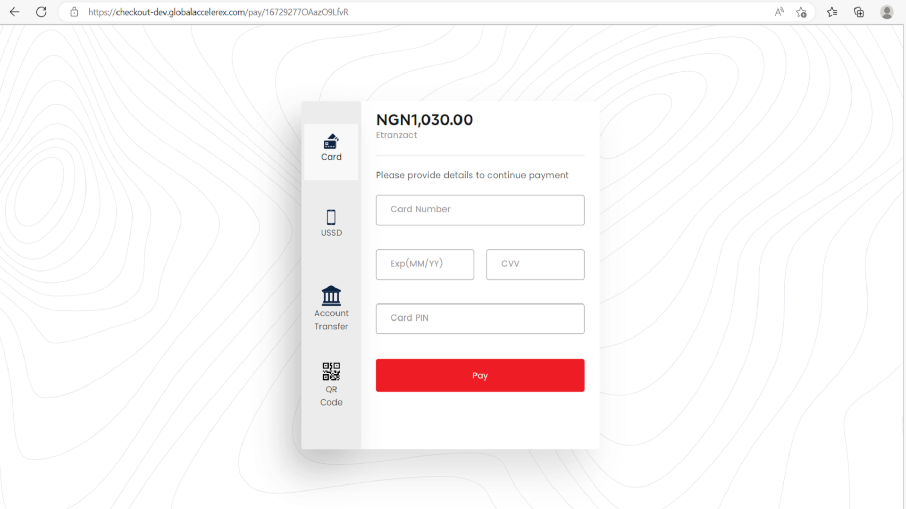
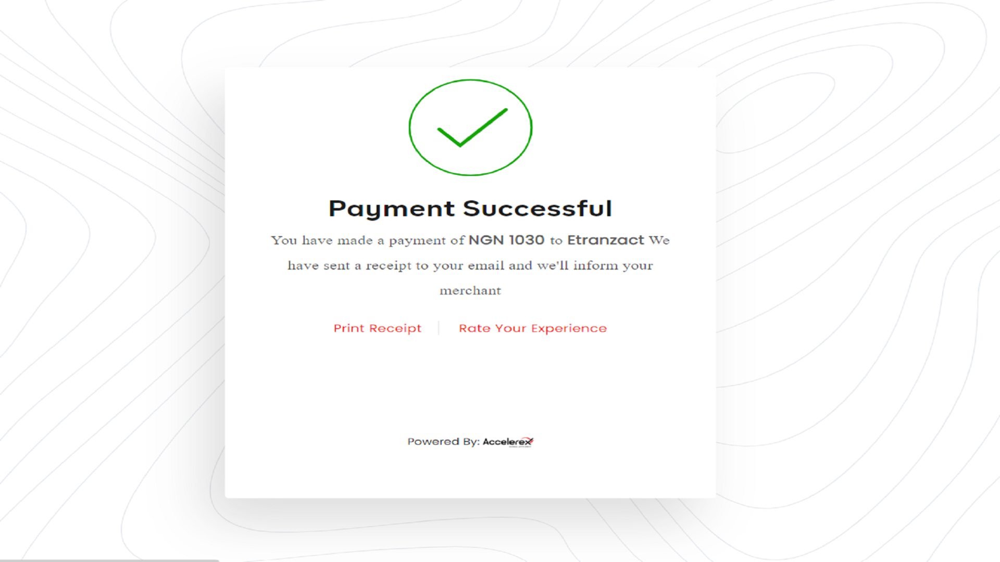

# RexPay Payment Gateway

- **Contributors:** globalaccelerex, valoni01
- **Tags:** woocommerce, payment gateway,international, mastercard, visa, rexpay
- **Requires at least:** 4.7
- **Tested up to:** 6.1.1
- **Stable tag:** 2.0.1
- **License:** MIT - see below

Make collections on your store using Rex-Pay.

## Description

A Woocommerce payment gateway plugin that allows merchants to integrate RexPay express checkout on their store checkout page, offering their customers a variety of payment options( Credit card, Debit card USSD, and Bank account).

TAKE CREDIT CARD PAYMENTS EASILY AND DIRECTLY ON YOUR E-COMMERCE STORE
The RexPay Payment Gateway plugin extends WooCommerce allowing you to take payments directly on your store via Global Accelerex's API.

Please take time to read through our terms of use and privacy policies [here](https://myrexpay.com/terms)

RexPay is available in:
* __Nigeria__

## Available Features on RexPay
* Multiple payment options (Card, Bank Account, Bank Transfer, USSD, QR)
* Robust Reporting & Analytics
* Audit and Fraud Control -
* Recurring Payments
* Identity Verification
* 2Factor Authentication (3DS)
* Admin and Reporting portal
* Seamless Onboarding

## Installation

### Automatic Installation
*   Login to your WordPress Dashboard.
*   Click on "Plugins > Add New" from the left menu.
*   In the search box type __RexPay Payment Gateway__.
*   Click on __Install Now__ on __Rex-Pay Payment Gateway__ to install the plugin on your site.
*   Confirm the installation.
*   Activate the plugin.
*   Click on "WooCommerce > Settings" from the left menu and click the __"Payments"__ tab.
*   Click on the __Rexpay__ link from the available Checkout Options
*   Configure your __RexPay Payment Gateway__ settings accordingly.

### Manual Installation
*  Download the plugin zip file.
*  Login to your WordPress Admin. Click on "Plugins > Add New" from the left menu.
*  Click on the "Upload" option, then click "Choose File" to select the zip file you downloaded. Click "OK" and "Install Now" to complete the installation.
*  Activate the plugin.
*  Click on "WooCommerce > Settings" from the left menu and click the __"Payments"__ tab.
*  Click on the __RexPay__ link from the available Checkout Options
*  Configure your __RexPay Payment Gateway__ settings accordingly.

For FTP manual installation, [check here](http://codex.wordpress.org/Managing_Plugins#Manual_Plugin_Installation).

### Configure the plugin
To configure the plugin, go to __WooCommerce > Settings__ from the left menu, click __Payments__ tab. Click on __Rave__.

* __Enable/Disable__ - check the box to enable Rave Payment Gateway.
* __Mode__ - uncheck the box to enable Live Mode.
* __Enter Client SecretKey__ - ensure that client secret key entered is the same with the one supplied to you by Rex-pay.
* __Enter Client ID__ - enter your client ID.
* Click __Save Changes__ to save your changes.

### For Suggestions
Feel free to contact us [here](support@globalaccelerex.com) or via 0700-2223-53739 if you have any suggestions or a new feature request.

## Screenshots ##

##### 1. RexPay Payment Gateway Setting Page

###
##### 2. RexPay Payment Gateway on woocommerce order checkout page

###
##### 3. RexPay modal showing card payment option

###
##### 4. RexPay modal showing payment successful

### PRIVACY DISCLOSURE
This plugin does not store any personal data.
The RexPay Payment Gateway plugin extends WooCommerce allowing you to take payments directly on your store via Global Accelerex's API.
Our privacy policy is available [here](https://myrexpay.com/terms)

